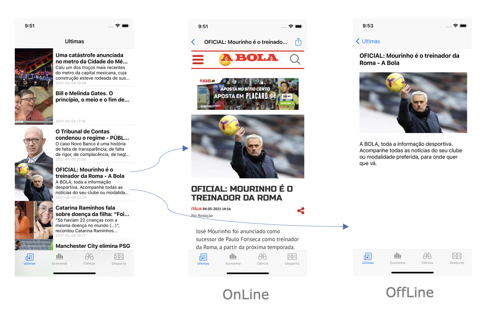
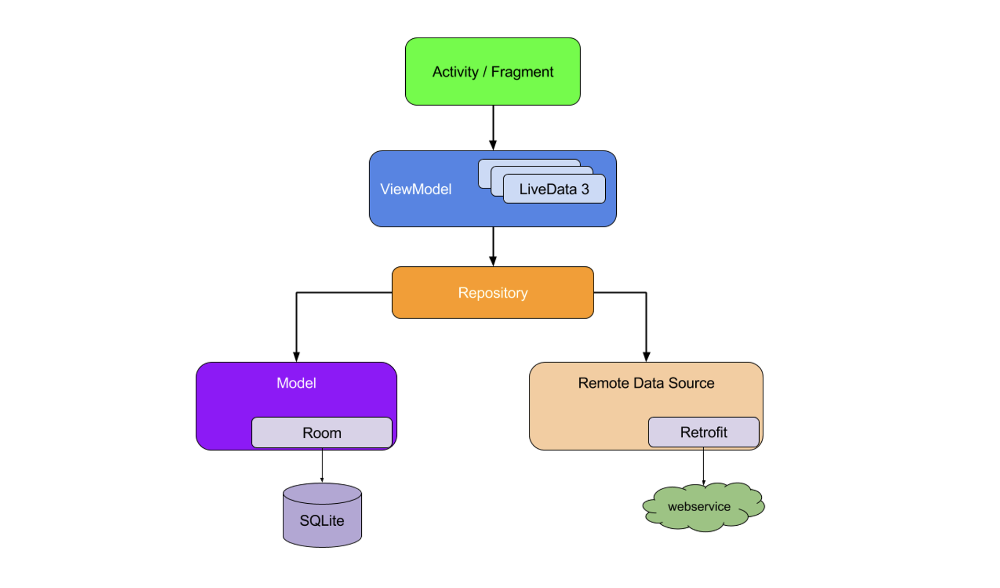
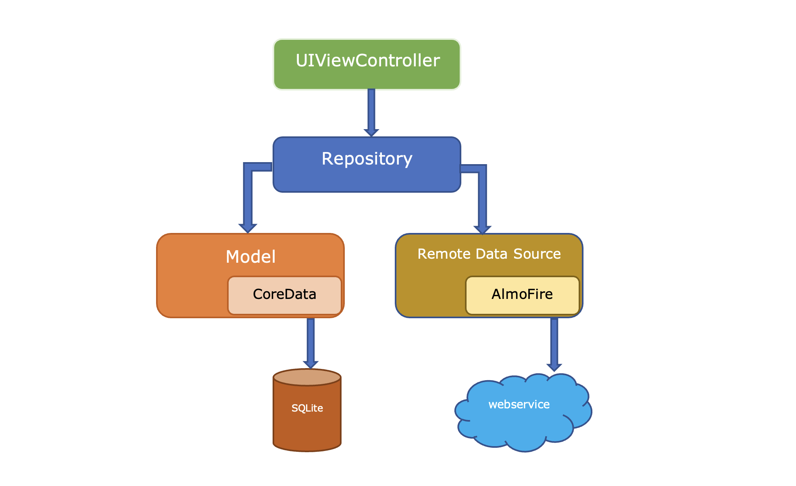

Mixing Android and iOS programming concepts
=============================================

Summary
-------

This project is a guide for iOS and Android mobile app development, following guidelines provided by the architecture manufacturers. The goal is to define a single guideline for easy development, support and maintenance of iOS and Android apps written in native languages. It is focused on the app engine of both architectures, from data acquisition via an API, through persistent storage and to data display to the end user.

Introduction
------------

In this example, we present a common application that exchanges information with a server through a REST API, and displays it to the user. The application also stores this information so that it can be accessed in offline mode. This same information should be updated whenever the app establishes connection with the server. The app presented is a news app displaying a list of articles in the home screen, followed by the article details when an article is selected. The article details page should present the newspaper website if the mobile phone is online, and a picture, title and description if the mobile phone is offline.



#### API - newsapi.org

The newsapi is used as the REST API to provide the news. The following request retrieves the latest news for a specific country.

Request:
```
GET https://newsapi.org/v2/top-headlines?country=us&apiKey=<API KEY>
```

Response:
```javascript
{
  "status": "ok",
  "totalResults": 38,
  "articles": [
    {
      "source": {
        "id": "cnn",
        "name": "CNN"
      },
      "author": "Story by Reuters",
      "title": "Teenager [...]" ,
      "url": "https://www.cnn.com/2021/05/05/americas/brazil-daycare-stabbing-intl-hnk/index.html",
      "urlToImage": "https://cdn.cnn.com/cnnnext/dam/assets/210505004438-brazil-daycare-stabbing-0504-super-tease.jpg",
"publishedAt":  "2021-05-05T05:19:00Z",
      "content": null
    },
    {
      "source": {
        "id": null,
        "name": "KING5.com"
      },
      "author": "KING 5 Staff",
      "title": "SpaceX Starlink [...]",
      "description": "A University of [...]." ,
      "url": "https://www.king5.com/article/tech/science/lights-streaking-across-night-sky-in-western-washington-again/281-a4227a83-20ca-484d-8e0d-da48b4fa8f97",
      "urlToImage": "https://media.king5.com/assets/KING/images/c80a000e-32c5-46ba-8da3-dc25d0d3455e/c80a000e-32c5-46ba-8da3-dc25d0d3455e_1140x641.jpg",
"publishedAt":  "2021-05-05T05:08:00Z",
      "content": "SEATTLE It appears s[...]"
    },
 [...]
}
```

#### Open API and Swagger

To reduce the written code, we use OPENAPI to describe server requests and data models, and then generate code with Swagger for Android and iOS.

This [file](TopNews-Android/app/src/main/java/swagger.yaml) describes the API following the [OpenAPI](https://oai.github.io) specification.

Now, using [Swagger](https://swagger.io) code generator, we reduce the required API calls on Android:

```kotlin
val newsApi: NewsApi by lazy { retrofit.create(NewsApi:: class.java) }
val serverArticles = newsApi.topHeadlinesGet( country, category, apiKey)
```

And on iOS:

```swift
NewsAPI.topHeadlinesGet(apiKey: NEWS_API_KEY, country: COUNTRY, category: category) { 
	(articles, error) in 
	[...]
}
```

Android Architecture
--------------------

Google proposes the following architecture:



The full description of the architecture can be found [here](https://developer.android.com/guide/components/activities/activity-lifecycle).

From the bottom up, we now describe the implementation of each of the represented components:

### Room

Android [Room](https://developer.android.com/jetpack/androidx/releases/room?gclid=Cj0KCQjwytOEBhD5ARIsANnRjVg8eMeCTZf2hnkkZja89BGmPTyCxUub-asFIK6KctvYRak8Ba8EjvQaAlj2EALw_wcB&gclsrc=aw.ds.) implements an abstraction layer to simplify storing persistent data using SQLite.
Room allows to create tables and fields through annotations in classes and their properties.
In this example, we use Room to store server data. We need to create one additional data model to allow data storage, since we cannot alter Swagger's data models.

| ArticleCache           |
|------------------------|
| - url        : String  |
| - jsonString : String? |
| - category   : String  |

In the `ArticleCache` model, the `url` is used as primary key and the jsonString stores the `Article` in a JSON string format. Finally, we use `category` to store the article category. This property is not a part of the API, but it is essential to know in what context a particular article should be shown.

The following code shows how to specify this class in Android using Room:

```kotlin
@Entity
class ArticleCache( @field:PrimaryKey 
                    var url        : String, 
                    var jsonString : String?, 
                    var category   : String) 
```

We declare an interface with the Data Access Object (DAO) and implement CRUD operations using `Query` annotation on top of each function signature.
These functions are marked as "suspend" so the compiler knows its content blocks the thread where they are running.

```kotlin
@Dao
interface ArticleCacheDao {
 
    @Query("SELECT * FROM ArticleCache WHERE category = :category")
    suspend fun getAll(category:String): List<ArticleCache>
 
    @Query("DELETE FROM ArticleCache WHERE url = :url")
    suspend fun delete(url: String)
 
    @Query("SELECT * FROM ArticleCache WHERE url = :url")
    suspend fun getByUrl(url: String): ArticleCache
 
    @Insert(onConflict = OnConflictStrategy. REPLACE)
    suspend fun insert(articleCache: ArticleCache)
}
```

The following code shows the initialization of the Room Database:

```kotlin
@Database(entities = [ArticleCache::class], version = 2)
abstract class AppDatabase : RoomDatabase() {
 
    abstract fun articleCacheDao(): ArticleCacheDao

    companion object {
        @Volatile private var INSTANCE: AppDatabase? = null
 
        fun getDatabase(context: Context): AppDatabase? {
            if (INSTANCE == null) {
                synchronized(AppDatabase::class.java) {
                    if (INSTANCE == null) {
                        INSTANCE = Room.databaseBuilder(
                            context.applicationContext,
                            AppDatabase::class.java,
                            "db_topnews"
                        ).fallbackToDestructiveMigration().build()
                    }
                }
            }
            return INSTANCE
        }
    }
}
```

`fallbackToDestructiveMigration` ensures that the database is rebuilt removing all content when the database version changes. This happens when apps can retrieve old data from the API.

### Remote Data Source - Backend

On the backend class, we initialize the HTTP API access using `OkHttp`. The `Retrofit` instance holds the `OkHttpClient` and the API url, and it converts JSON objects' responses from the API into Kotlin data models.

```kotlin
class Backend {
    private val retrofit : Retrofit
    init {
        val httpClient = OkHttpClient.Builder()
                .connectTimeout(30, TimeUnit.SECONDS)
                .writeTimeout(1, TimeUnit.MINUTES)
                .readTimeout(2, TimeUnit.MINUTES)
                .build()
        retrofit = Retrofit.Builder()
                .baseUrl("https://newsapi.org/v2/")
                .addConverterFactory(GeneratedCodeConverters.converterFactory())
                .client(httpClient)
                .build()
 
    }
    // endpoints
    val newsApi: NewsApi by lazy { retrofit.create(NewsApi:: class.java) }
}
```

### Repository

The repository class gathers data from the server and stores it on the local database without duplications. When the user opens the app, he sees first the data stored on the mobile, and then the data fetched from the server.
This class is declared as a `Singleton` that allows the object to be instantiated only once in the application lifecycle.

The `getCachedArticles` function asks the local database for articles of a specific category.

```kotlin
object Repository {
    private val backend = Backend()

    suspend fun getCachedArticles (context: Context, category: String) : Articles {
        val articles = Articles()

        val totalArticlesCached = AppDatabase.getDatabase(context)?
        .articleCacheDao()?
        .getAll(category)
        val articlesLocal : MutableList<Article> = arrayListOf()
        totalArticlesCached?.let {
            for (articleCached in it) {
                val article = Article().fromJson(articleCached.jsonString)
                article?.let { it1 -> articlesLocal.add(it1) }
            }
        }

        articles.articles = articlesLocal         
        articles.status = "local"         
        articles.totalResults = articlesLocal.size

        return articles     
    }
	[...]
}
```

The `getArticles` function returns a `LiveData` object, which is an observable data class. This type of object notifies another observer object type when `emit` is triggered. In this case `emit` is triggered twice: first with the local data and then after fetching remote data.

```kotlin
object Repository {

     fun getArticles( category: String, 
		 country: String, 
		 apiKey: String, 
		 context: Context): LiveData<Articles> = liveData(IO) {
        emit( getCachedArticles (context, category) )
        try {
            val serverArticles = backend.newsApi.topHeadlinesGet( country, category, apiKey)
            serverArticles.articles?.forEach { article ->                 
		article.url?.let { url ->                     
		val articleCache = ArticleCache(url, article.toJsonString(), category)
                    AppDatabase.getDatabase(context)?.articleCacheDao()?.insert(articleCache)
                }
                emit( getCachedArticles (context, category) )
            }
        } catch (throwable: Throwable) {
            Log.e("Repository", throwable.toString())
        }
    }

}
```

### View Model

Due to their lifecycle, the activity or fragment can be destroyed and recreated in response to user or operating system actions. When this happens, it will also destroy all data held by the activity. Since these are asynchronous tasks, creating and destroying the activity lifecycle tasks can be difficult to manage.
To work around this problem, Google proposes the `ViewModel`, which recreates the lifecycle of the view component. This way the obtained data is saved by `ViewModel`, which is independent of the component that created it.
In this example the ArticlesViewModel class, which inherits from the `ViewModel` class, obtains the data from the repository. The `switchMap` method ensures that the repository is accessed only when the category value is modified.

```kotlin
class ArticlesViewModel() : ViewModel() {
 
    private val _category: MutableLiveData<String> = MutableLiveData()
 
    val articlesForCategory: LiveData<Articles> =
        Transformations.switchMap(_category) {
            Repository.getArticles( it,Globals.COUNTRY, 
                Globals.NEWS_API_KEY, context!!)
        }
 
    private var context : Context? = null
 
    fun setCategory(category: String, context: Context) {
        this.context = context
        if (_category.value == category) return
        _category.value = category
    }
 
}
```

### Controller Activity/Fragment

The following example uses Fragments, but the process is similar as in Activities. First, we bind the ViewModel to the controller. After the ViewModel initializes, an observer that references the `viewLifeCycleOwner` needs to be created, which, in this case, represents the Fragment lifecycle. The observer now runs while the `viewLifeCycleOwner` stays active.

```kotlin
     private lateinit var mainActivityViewModel: ArticlesViewModel
 
     override fun onViewCreated(view: View, savedInstanceState: Bundle?) {
        super.onViewCreated(view, savedInstanceState)
 
        mainActivityViewModel = ViewModelProvider(this, 
            ViewModelProvider.NewInstanceFactory())
            .get(ArticlesViewModel::class.java)
 
        mainActivityViewModel.articlesForCategory.observe(viewLifecycleOwner, 
            Observer { totalArticlesCached->
            totalArticlesCached?.let { fetchedArticles ->
                fetchedArticles.articles?.let { articlesList ->
                    articles = articlesList.sortedByDescending {
                        it.publishedAt
                    }
                    mAdapter?.notifyDataSetChanged()
                }
            }
        })
        mainActivityViewModel.setCategory(Globals.ENDPOINT_GENERAL, requireContext())
    }
```

iOS Architecture
--------------------

Apple still uses [MVC](https://developer.apple.com/library/archive/documentation/General/Conceptual/DevPedia-CocoaCore/MVC.html) architecture. The main reason is because the `UIViewController` is only destroyed when there are no references pointing to that object. To approach this to the Android implementation, we create a class repository to aggregate local and server data.



### Model - CoreData

On Xcode we create the data model using CoreData designer. In the `Editor` menu, we select `Create NSManagedObject Subclass` to generate the following extension:

```swift
extension ArticleCache {
    @nonobjc public class func fetchRequest() -> NSFetchRequest<ArticleCache> {
        return NSFetchRequest<ArticleCache>(entityName: "ArticleCache")
    }
    @NSManaged public var url: String?
    @NSManaged public var jsonString: String?
    @NSManaged public var category: String?
}
```

The CoreData designer creates and modifies the `ArticleCache` extension. We can modify the class `ArticleCache` to implement the CRUD operations as follows:

```swift
@objc(ArticleCache)
public class ArticleCache: NSManagedObject {
    
    class func addItem(url: String, jsonString: String, category: String, 
                        inManagedObjectContext  context:NSManagedObjectContext) -> ArticleCache? {
        
        let request = NSFetchRequest<NSFetchRequestResult>(entityName: "ArticleCache")
        request.predicate = NSPredicate(format: "url = %@", url)
       
        if let _ = (try? context.fetch(request))?.first as? ArticleCache {
            return updateItem(url: url, jsonString: jsonString, category: category, 
                                inManagedObjectContext: context)
        }
        else if let articleCache = NSEntityDescription.insertNewObject(
                                    forEntityName: "ArticleCache", 
                                    into: context) as? ArticleCache {
            articleCache.url        = url
            articleCache.jsonString = jsonString
            articleCache.category   = category
            return articleCache
        }
        return nil
    }
    
    class func updateItem(url: String, jsonString: String, category: String, 
                            inManagedObjectContext context: NSManagedObjectContext) -> ArticleCache? {
       [...]
    }
    
    class func getAll(category: String, 
                        inManagedObjectContext context:NSManagedObjectContext) -> [ArticleCache]?  {
        [...]
    }
    
   [...]
}
```

### Repository

As in Android, we implement the repository class to gather data from the server and store it on the local database without duplications. When the user opens the app, he sees first the data stored on the mobile and then the data fetched from the server.

```swift
class Repository {
    
    class func getCachedArticles(category: String, context: NSManagedObjectContext) -> [Article] {
        var articles : [Article] = []
        if let articlesCache = ArticleCache.getAll(category: category,
                                                   inManagedObjectContext:context ) {
            for articleCache in articlesCache {
                if let articleJson = articleCache.jsonString{
                    let article = Article.fromJson(jsonString: articleJson)
                    articles.append(article)
                }
            }
            return articles
        }
        return articles
    }
    [...]
}
```

The `getArticles` function returns the data on the `callback` function, which is triggered whenever new data are available. The `callback` is triggered twice: first with the local data, and then after requesting data from the API. Data from the API is first stored on local database and then issued.

```swift
class Repository {
  [...]
     class func getArticles ( category :String, 
		           context : NSManagedObjectContext, 
		  	callback : @escaping ([Article], Error?)->() ) 
    {
        var chachedArtilces : [Article] = getCachedArticles(category: category, context: context)
        callback(chachedArtilces, nil )
 
        NewsAPI.topHeadlinesGet(apiKey: NEWS_API_KEY,
                                country: COUNTRY,
                                category: category) { (articles, error) in
            if (error == nil){
                if let arts = articles?.articles {
                    for article in arts{
                        _ = ArticleCache.addItem(url: article.url ?? "",
                                             jsonString: article.toJsonString(),
                                             category: category,
                                             inManagedObjectContext: context)
                    }
                }
                (UIApplication.shared.delegate as? AppDelegate)?.saveContext()
                chachedArtilces = getCachedArticles(category: category, context: context)
                callback(chachedArtilces, nil )
            }else {
                callback(chachedArtilces, error )
                print(error.debugDescription)
            }
        }
    }
}
```

### Controller & Model

The data binding with the controller is now simplified. We can access the repository after database context is set. The UI waits for the callback trigger to update.

```swift
class ArticlesTVC: UITableViewController {
    
    var articles : [Article] = []
    var category : String = ""
    
    private var managedObjectContext: NSManagedObjectContext? {
        didSet {
            if let context = managedObjectContext {
                 Repository.getArticles(category: self.category, context: context,callback: { articles, error in
                    if error == nil {
                        self.articles = articles
                        self.tableView.reloadData()
                    }
                })
            }
        }
    }
    
    override func viewDidLoad() {
        super.viewDidLoad()
        self.managedObjectContext = (UIApplication.shared.delegate as? AppDelegate)?.persistentContainer.viewContext
    }
 ... 
}
```

Discussion
----------

iOS and Android operating systems have a rich documentation that helps developers design high performance apps. Despite all the documentation provided, it is not always possible to find a common thread to help developers find the best methods and programming practices to develop what we here refer as a common application.
Furthermore, a common application is useful if available on both operating systems, which exacerbates the problem of gathering all the information needed to produce good applications for both operating systems.
Although the code is different for Android and iOS, a very similar base architecture can be defined when writing applications for both operating systems. The new programming languages Swift and Kotlin also help, as they have many similarities. Both share the object-oriented programming paradigm and new features of modern languages. Currently, the only major difference between both base architectures is the new MVVM proposed by Google that increases the stability of Android applications.
By adopting a similar base architecture, the development and support of applications becomes simpler. This allows the programmer to focus on another fundamental part: the development of the graphical interface. This should be different according to guidelines of each platform, providing the best user experience to Android and iOS users.

License & copyright
-------------------

Copyright 2020 Lourenço Gomes

Licensed under [MIT License](LICENSE)
