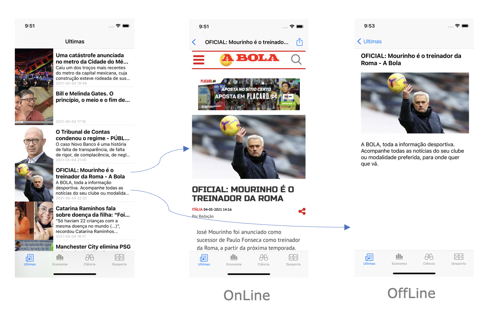

Mixing Android and iOS programming concepts
=============================================

Summary
-------

This project is a guide for iOS and Android mobile app development, following guidelines provided by the architecture manufacturers. The goal is to define a single guideline for easy development, support and maintenance of iOS and Android apps written in native languages. It is focused on the app engine of both architectures, from data acquisition via an API, through persistent storage and to data display to the end user.

Introduction
------------

In this example, we present a common application that exchanges information with a server through a REST API, and displays it to the user. The application also stores this information so that it can be accessed in offline mode. This same information should be updated whenever the app establishes connection with the server. The app presented is a news app displaying a list of articles in the home screen, followed by the article details when an article is selected. The article details page should present the newspaper website if the mobile phone is online, and a picture, title and description if the mobile phone is offline.



#### API - newsapi.org

The newsapi is used as the REST API to provide the news. The following request retrieves the latest news for a specific country.

Request:
```
GET https://newsapi.org/v2/top-headlines?country=us&apiKey=<API KEY>
```

Response:
```javascript
{
  "status": "ok",
  "totalResults": 38,
  "articles": [
    {
      "source": {
        "id": "cnn",
        "name": "CNN"
      },
      "author": "Story by Reuters",
      "title": "Teenager [...]" ,
      "url": "https://www.cnn.com/2021/05/05/americas/brazil-daycare-stabbing-intl-hnk/index.html",
      "urlToImage": "https://cdn.cnn.com/cnnnext/dam/assets/210505004438-brazil-daycare-stabbing-0504-super-tease.jpg",
"publishedAt":  "2021-05-05T05:19:00Z",
      "content": null
    },
    {
      "source": {
        "id": null,
        "name": "KING5.com"
      },
      "author": "KING 5 Staff",
      "title": "SpaceX Starlink [...]",
      "description": "A University of [...]." ,
      "url": "https://www.king5.com/article/tech/science/lights-streaking-across-night-sky-in-western-washington-again/281-a4227a83-20ca-484d-8e0d-da48b4fa8f97",
      "urlToImage": "https://media.king5.com/assets/KING/images/c80a000e-32c5-46ba-8da3-dc25d0d3455e/c80a000e-32c5-46ba-8da3-dc25d0d3455e_1140x641.jpg",
"publishedAt":  "2021-05-05T05:08:00Z",
      "content": "SEATTLE It appears s[...]"
    },
 [...]
}
```

#### Open API and Swagger

To reduce the written code, we use OPENAPI to describe server requests and data models, and then generate code with Swagger for Android and iOS.

This [file](TopNews-Android/app/src/main/java/swagger.yaml) describes the API following the [OpenAPI](https://oai.github.io) specification.

Now, using [Swagger](https://swagger.io) code generator, we reduce the required API calls on Android:

```kotlin
val serverArticles = newsApi.topHeadlinesGet( country, category, apiKey)
```
The `newsApi` object is now injected using [dagger hilt](https://developer.android.com/training/dependency-injection/hilt-android) pattern.

And on iOS:

```swift
NewsAPI.topHeadlinesGet(apiKey: NEWS_API_KEY, country: COUNTRY, category: category) { 
	(articles, error) in 
	[...]
}
```

Android Architecture
--------------------

From the bottom up, we now describe the implementation of each of the represented components:

### Room

Android [Room](https://developer.android.com/jetpack/androidx/releases/room?gclid=Cj0KCQjwytOEBhD5ARIsANnRjVg8eMeCTZf2hnkkZja89BGmPTyCxUub-asFIK6KctvYRak8Ba8EjvQaAlj2EALw_wcB&gclsrc=aw.ds.) implements an abstraction layer to simplify storing persistent data using SQLite.
Room allows to create tables and fields through annotations in classes and their properties.
In this example, we use Room to store server data. We need to create one additional data model to allow data storage, since we cannot alter Swagger's data models.

| ArticleCache           |
|------------------------|
| - url        : String  |
| - jsonString : String? |
| - category   : String  |

In the `ArticleCache` model, the `url` is used as primary key and the jsonString stores the `Article` in a JSON string format. Finally, we use `category` to store the article category. This property is not a part of the API, but it is essential to know in what context a particular article should be shown.

The following code shows how to specify this class in Android using Room:

```kotlin
@Entity
class ArticleCache( @field:PrimaryKey 
                    var url        : String, 
                    var jsonString : String?, 
                    var category   : String) 
```

We declare an interface with the Data Access Object (DAO) and implement CRUD operations using `Query` annotation on top of each function signature.
These functions are marked as "suspend" so the compiler knows its content blocks the thread where they are running.

```kotlin
@Dao
interface ArticleCacheDao {
 
    @Query("SELECT * FROM ArticleCache WHERE category = :category")
    suspend fun getAll(category:String): List<ArticleCache>
 
    @Query("DELETE FROM ArticleCache WHERE url = :url")
    suspend fun delete(url: String)
 
    @Query("SELECT * FROM ArticleCache WHERE url = :url")
    suspend fun getByUrl(url: String): ArticleCache
 
    @Insert(onConflict = OnConflictStrategy. REPLACE)
    suspend fun insert(articleCache: ArticleCache)
}
```

The following code shows the initialization of the Room Database:

```kotlin
@Database(entities = [ArticleCache::class], version = 4)
abstract class AppDatabase : RoomDatabase() {

    abstract fun articleCacheDao(): ArticleCacheDao

}

@Module
@InstallIn(SingletonComponent::class)
object AppModule {

    ...

    @Provides
    @Singleton
    fun provideRepository(api:NewsApi, db:AppDatabase): Repository {
        return Repository(api,db)
    }
    
    @Singleton
    @Provides
    fun provideArticlesDatabase(
        @ApplicationContext app: Context
    ) = Room.databaseBuilder(
        app,
        AppDatabase::class.java,
        "db_topnews"
    ).fallbackToDestructiveMigration().build()
    
    ...
}

```

`fallbackToDestructiveMigration` ensures that the database is rebuilt removing all content when the database version changes. This happens when apps can retrieve old data from the API.

### Remote Data Source - API

To access the API is now reduce to a line of code, we initialize the HTTP API access using dependency injection with [dagger hilt](https://developer.android.com/training/dependency-injection/hilt-android) pattern.
. The `Retrofit` instance holds the `OkHttpClient` and the API url, and it converts JSON objects' responses from the API into Kotlin data models.


```kotlin
...
newsApi.topHeadlinesGet(country, category, NEWS_API_KEY)
...

@Module
@InstallIn(SingletonComponent::class)
object AppModule {

    ...
    
    @Provides
    @Singleton
    fun provideNewsApi(): NewsApi {
        return NewsApi()
    }
    ...

}

```

### Repository

The repository class gathers data from the server and stores it on the local database without duplications. When the user opens the app, he sees first the data stored on the mobile, and then the data fetched from the server.
This class is initialized as `Singleton` on the `AppModule` class that allows the object to be instantiated only once in the application lifecycle.

The `getCachedArticles` function asks the local database for articles of a specific category.

```kotlin
class Repository @Inject constructor(
    private val newsApi: NewsApi,
    private val db:AppDatabase
){

    private suspend fun getCachedArticles(category: String) : Articles {
        val articles = Articles()

        val totalArticlesCached = db.articleCacheDao().getAll(category)
        val articlesLocal : MutableList<Article> = arrayListOf()
        totalArticlesCached.let {
            for (articleCached in it) {
                val article = Article().fromJson(articleCached.jsonString)
                article?.let { it1 -> articlesLocal.add(it1) }
            }
        }

        articles.articles = articlesLocal.toTypedArray()
        articles.status = "local"
        articles.totalResults = articlesLocal.size

        return articles
    }
	[...]
}
```

The `getArticles` function returns a `Flow` object, which is an observable data class. This type of object notifies another observer object type when `emit` is triggered. In this case `emit` is triggered twice: first with the local data and then after fetching remote data.

```kotlin
class Repository @Inject constructor(
    private val newsApi: NewsApi,
    private val db:AppDatabase
){
    ...
    
    fun fetchArticles(country : String, category: String) : Flow<ResultWrapper<Articles>> =
        flow {
            try {
                emit(ResultWrapper.Loading())
                var articles : Articles = getCachedArticles(category)
                emit(ResultWrapper.Success(articles))

                articles = newsApi.topHeadlinesGet(country, category, NEWS_API_KEY)
                articles.articles?.forEach { article ->
                    article.url?.let { url ->
                        val articleCache = ArticleCache(url, article.toJsonString(), category)
                        db.articleCacheDao().insert(articleCache)
                    }
                }
                emit(ResultWrapper.Success(articles))
            }catch (e : HttpException){
                emit(ResultWrapper.Error(e.localizedMessage?:"Unexpected Error"))
            }catch (e: IOException){
                emit(ResultWrapper.Error("No internet connection"))
            }
        }.flowOn(Dispatchers.IO)

}
```

### View Model

When developing apps with android compose views are stateless, so all view data must be stored on a `data class` holding the state of the view, so the view will be redrawn if the state changes.
Inside the `ViewModel` is now declared de state object that holds the view state, and also the business logic that controls the view.
    

```kotlin
data class ArticlesState(
    val articles: Articles? = null,
    val error : String = "",
    val isLoading : Boolean = false,
)

@HiltViewModel
class ArticlesViewModel @Inject constructor(
    val repository: Repository,
    val savedStateHandle: SavedStateHandle) : ViewModel() {


    companion object{
        const val PARAM_COUNTRY = "country"
        const val PARAM_CATEGORY = "category"
    }

    private val _state = mutableStateOf<ArticlesState>(ArticlesState())
    val state : State<ArticlesState> = _state

    init {
        savedStateHandle.get<String>(PARAM_CATEGORY)?.let { category ->
            getArticles("us", category)
        }?:run {
            getArticles("us", "general")
        }

    }

    private fun getArticles(country :String, category: String) {
        repository.fetchArticles( country, category).onEach{ result->
            when(result){
                is ResultWrapper.Success -> {
                    _state.value = ArticlesState( articles = result.data )
                }
                is ResultWrapper.Loading ->{
                    _state.value = ArticlesState( isLoading = true)
                }
                is ResultWrapper.Error->{
                    _state.value = ArticlesState( error = result.message ?: "unexpected")
                }
            }
        }.launchIn(viewModelScope)
    }

}
```

### Composable View

The `viewmodel` that contains the business logic for the composable view should be initialized when creating the view so we can pass only the state. The reason no to pass the view model is only to be able to preview the composable view when designing, because `State` is a simpler object to initialize.  

```kotlin

...
val viewModel = hiltViewModel<ArticlesViewModel>()
val state = viewModel.state.value

ArticlesList(
    navController = navController,
    state = state
)
...


@Composable
fun ArticlesList(
    navController: NavController,
    state : ArticlesState
) {
    Box(modifier = Modifier.fillMaxSize()){
        if(state.error.isNotBlank()){
            Text(
                text = state.error,
                color = MaterialTheme.colorScheme.error,
                textAlign = TextAlign.Center,
            )
        }else if(state.isLoading){
            Text(
                text = "Loading Articles...",
                color = MaterialTheme.colorScheme.primary,
                textAlign = TextAlign.Center,
            )
        }else {
            LazyColumn(
                contentPadding = PaddingValues(all = 12.dp),
                verticalArrangement = Arrangement.spacedBy(12.dp)
            ) {
                itemsIndexed(
                    items = state.articles?.articles ?: arrayOf(),
                    key = { index, article ->
                        article.url!!
                    }
                ) { index, article ->
                    Log.d("MainActivity", index.toString())
                    ArticleRow(
                        article = article,
                        onItemClick = {
                            navController.navigate(
                                Screen.Article.route
                                    .replace("{articleUrl}", article.url!!.encodeURL())
                                    .replace("{articleTitle}", article.title!!)
                            )
                        }
                    )
                }
            }
        }
    }
}

```

iOS Architecture
--------------------

From the bottom up, we now describe the implementation of each of the represented components:


### Model - CoreData

On Xcode we create the data model using CoreData designer. In the `Editor` menu, class items will now be generated automatically:

The CoreData designer creates and modifies the `ArticleCache`. If we want to added functionality we can use extensions to implement the CRUD operations as follows:

```swift
extension ArticleCache {

    class func addItem(url: String, jsonString: String, category: String, inManagedObjectContext  context:NSManagedObjectContext) ->ArticleCache?{
        
        let request = NSFetchRequest<NSFetchRequestResult>(entityName: "ArticleCache")
        request.predicate = NSPredicate(format: "url = %@", url)
        
        if let _ = (try? context.fetch(request))?.first as? ArticleCache {
            return updateItem(url: url, jsonString: jsonString, category: category, inManagedObjectContext: context)
        }
        else if let articleCache = NSEntityDescription.insertNewObject(forEntityName: "ArticleCache", into: context) as? ArticleCache {
            articleCache.url        = url
            articleCache.jsonString = jsonString
            articleCache.category   = category
            return articleCache
        }
        return nil
    }
    
    class func updateItem(url: String, jsonString: String, category: String, inManagedObjectContext  context:NSManagedObjectContext) ->ArticleCache?{
      ...
    }
    
   ...

}
```

### Repository

As in Android, we implement the repository class to gather data from the server and store it on the local database without duplications. When the user opens the app, he sees first the data stored on the mobile and then the data fetched from the server.

```swift
class Repository {
    
    class func getCachedArticles(category: String, context: NSManagedObjectContext) -> [Article] {
        var articles : [Article] = []
        if let articlesCache = ArticleCache.getAll(category: category,
                                                   inManagedObjectContext:context ) {
            for articleCache in articlesCache {
                if let articleJson = articleCache.jsonString{
                    let article = Article.fromJson(jsonString: articleJson)
                    articles.append(article)
                }
            }
            return articles
        }
        return articles
    }

    [...]
}
```

The `getArticles` function returns the data on the `callback` function, which is triggered whenever new data are available. The `callback` is triggered twice: first with the local data, and then after requesting data from the API. Data from the API is first stored on local database and then issued.

```swift
class Repository {
  [...]
    class func getArticles ( category :String, context: NSManagedObjectContext, callback : @escaping ([Article], Error?)->() ) {
        var chachedArtilces : [Article] = getCachedArticles(category: category, context: context)
        callback(chachedArtilces, nil )
        NewsAPI.topHeadlinesGet(apiKey: NEWS_API_KEY,
                                country: COUNTRY_US,
                                category: category) { (articles, error) in
            if (error == nil){
                if let arts = articles?.articles {
                    for article in arts{
                        _ = ArticleCache.addItem(url: article.url ?? "",
                                             jsonString: article.toJsonString(),
                                             category: category,
                                             inManagedObjectContext: context)
                    }
                }
                do {
                    try context.save()
                } catch {
                    // Replace this implementation with code to handle the error appropriately.
                    // fatalError() causes the application to generate a crash log and terminate. You should not use this function in a shipping application, although it may be useful during development.
                    let nsError = error as NSError
                    fatalError("Unresolved error \(nsError), \(nsError.userInfo)")
                }
                chachedArtilces = getCachedArticles(category: category, context: context)
                callback(chachedArtilces, nil )
            }else {
                callback(chachedArtilces, error )
                print(error.debugDescription)
            }
        }
    }
}
```

### Controller & Model

When developing apps with SwiftUI views are stateless, so all view data must be stored on a`viewModel` annotated with `@ObservedObject` holding the state of the view, so the view will be redrawn if the state changes.
Inside the `ViewModel` is now declared de state object that holds the view state, and also the business logic that controls the view.


```swift
struct ArticlesView: View {
    var country : String
    var category : String
    @Environment(\.managedObjectContext) private var viewContext
    @ObservedObject var viewModel : ArticlesViewModel = ArticlesViewModel()

    var body: some View {
        NavigationView {
            List {
                ForEach(viewModel.articleState.articles?.articles ?? [Article]()) { article in
                    NavigationLink(destination:
                                    ArticleDetailView(
                                        url:article.url ?? "",
                                        title: article.title ?? "")
                    ){
                        ArticleRowView(article: article)
                    }
                }
            }.onAppear{
                viewModel.getArticles(country: country, category: category, context: viewContext)
            }.navigationBarTitle(category.capitalized)
        }
    }
}
```

Discussion
----------

iOS and Android operating systems have a rich documentation that helps developers design high performance apps. Despite all the documentation provided, it is not always possible to find a common thread to help developers find the best methods and programming practices to develop what we here refer as a common application.
Furthermore, a common application is useful if available on both operating systems, which exacerbates the problem of gathering all the information needed to produce good applications for both operating systems.
Although the code is different for Android and iOS, a very similar base architecture can be defined when writing applications for both operating systems. The new programming languages Swift and Kotlin also help, as they have many similarities. Both share the object-oriented programming paradigm and new features of modern languages. Currently, the only major difference between both base architectures is the new MVVM proposed by Google that increases the stability of Android applications.
By adopting a similar base architecture, the development and support of applications becomes simpler. This allows the programmer to focus on another fundamental part: the development of the graphical interface. This should be different according to guidelines of each platform, providing the best user experience to Android and iOS users.

License & copyright
-------------------

Copyright 2020 Lourenço Gomes

Licensed under [MIT License](LICENSE)
